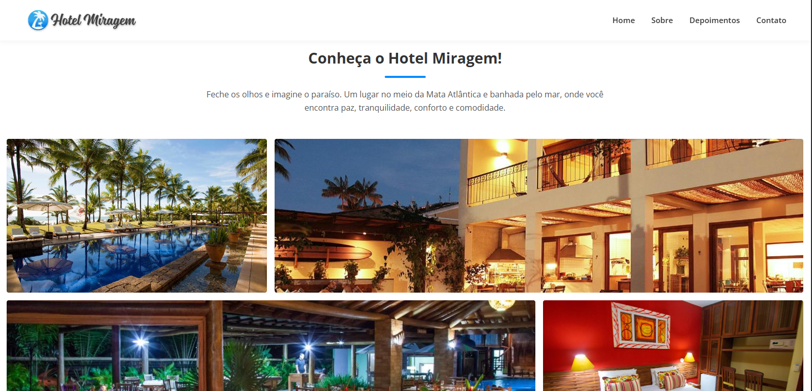
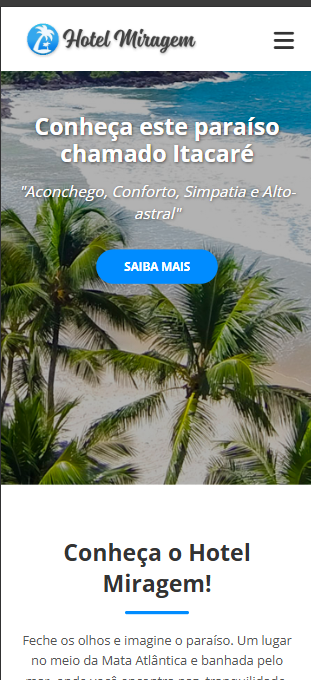

# Desafio-Front-End-Grupo-Ser-Educacional

## 🔗 Visão Geral do Projeto

O objetivo deste projeto foi criar um site institucional responsivo, intuitivo e visualmente agradável, seguindo fielmente o layout proposto no desafio.

O site contém:
- Página inicial com imagem de destaque (hero)
- Seção institucional “Sobre”
- Galeria de imagens
- Seção de depoimentos
- Seção de contato
- Menu responsivo para dispositivos móveis

---

## 🖥️ Layout – Desktop

### Página Inicial


### Galeria de Imagens


---

## 📱 Layout – Mobile

O site foi totalmente adaptado para dispositivos móveis, utilizando menu hambúrguer e layout fluido.



---

## 🚀 Tecnologias Utilizadas

- **HTML5**  
- **CSS3**
  - Flexbox
  - Media Queries
- **JavaScript (Vanilla JS)**
- Design responsivo (Mobile First)

---

## 🎯 Funcionalidades Implementadas

- Menu de navegação fixo no topo
- Scroll suave entre as seções do site
- Botão de chamada para ação (**Saiba Mais**)
- Seção institucional com descrição do hotel
- Galeria de imagens organizada em grid
- Layout visual alinhado ao design proposto
- Menu hambúrguer para dispositivos móveis
- Navegação fluida entre desktop e mobile

---

## 📱 Responsividade

O site foi desenvolvido com foco em **design responsivo**, garantindo boa experiência em diferentes dispositivos:

- Layout adaptável para **desktop, tablet e mobile**
- Menu responsivo com botão hambúrguer no mobile
- Imagens fluidas e redimensionáveis
- Tipografia ajustada conforme o tamanho da tela
- Estrutura flexível utilizando **Flexbox**
- Uso de **Media Queries** para adaptação de layout

---

## 📂 Estrutura do Projeto

```bash
hotel-miragem/
│
├── index.html
├── css/
│   └── style.css
├── js/
│   └── script.js
├── images/
│   ├── homepage.png
│   ├── imgrid.png
│   └── mobilepage.png
└── README.md
